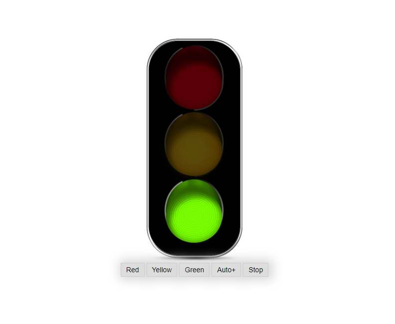

## SEMÁFORO 

 Simples semáforo desenvolvido para fins didático. 

🚀 ##Tecnologias

-HTML
-CSS3
-JAVASCRIPT 

🚀 ##Conceitos aplicados 
- DOM manipulation
- Logical
- Arrays
- Escope
- Closure
- Condition
- Etc.

